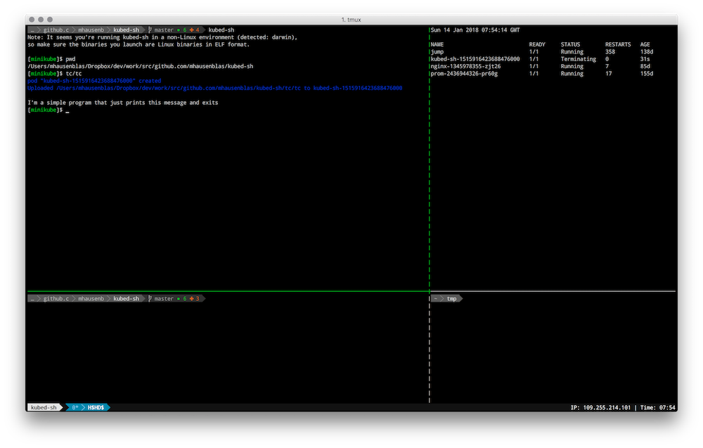

# kubed-sh

Hello and welcome to `kubed-sh`, the Kubernetes distributed shell for the casual cluster user.
If you have access to a [Kubernetes](https://kubernetes.io/) cluster, you can [install it](#install-it) now
and then learn how to [use it](#use-it). In a nutshell, with `kubed-sh` you can execute a program in a Kubernetes cluster
without having to create a container image or learn anything new, for example:



Above you see the Linux ELF binary `tc` that you get when doing a `GOOS=linux go build` in the test case directory [tc/](tc/),
executing in the Kubernetes cluster, producing the output `I'm a simple program that just prints this message and exits`.

In addition to launching (Linux ELF) binaries, the following interpreted environments are currently supported:

- When you enter `node script.js`, a Node.js (default version: 9.4) environment is provided and `script.js` is executed.
- When you enter `python script.py`, a Python (default version: 3.6) environment is provided and the `script.py` is executed.
- When you enter `ruby script.rb`, a Ruby (default version: 2.5) environment is provided and the `script.rb` is executed.

Note that `kubed-sh` is a proper shell environment, that is, you can expect features such as auto-complete, history operations,
or `CTRL+L` clearing the screen to work as per usual.


## Install it

Prerequisites (for now, this will likely change if this project gains any traction):

- There are no binaries, so you need Go installed in order to build it. I'm using `go1.9.2 darwin/amd64` on my machine.
- In order to work you need a Kubernetes cluster configured. If you do `ls ~/.kube/config > /dev/null && echo $?` you should see a `0` as a result.
- Currently, `kubed-sh` has the following dependencies (that is, must be installed on your local machine otherwise it won't work):
  - Go 1.9 or above to build `kubed-sh`
  - `kubectl` installed and configured. If you do `kubectl config get-contexts | wc -l` you should see a number greater than `0`.


Simply do:

```
$ go get github.com/mhausenblas/kubed-sh
```

If your `$GOPATH/bin` is in your `$PATH` then now you can use `kubed-sh` from everywhere. Alternatively you can:

- Do a `cd $GOPATH/src/github.com/mhausenblas/kubed-sh` followed by a `go build` and use it from this directory.
- Run it like so: `$GOPATH/bin/kubed-sh`

## Use it

Once you've `kubed-sh` installed, launch it and you should find yourself in a interactive shell, that is, an [REPL](https://en.wikipedia.org/wiki/Read%E2%80%93eval%E2%80%93print_loop).

TBD: example session

## FAQ

**Q**: Why another Kubernetes shell? There's already [cloudnativelabs/kube-shell](https://github.com/cloudnativelabs/kube-shell) and [c-bata/kube-prompt](https://github.com/c-bata/kube-prompt). <br>
**A**: True, there is previous art, though these shells more or less aim at making `kubectl` interactive, exposing the commands such as `get` or `apply` to the user.
In a sense `kubed-sh` is more like [technosophos/kubeshell](https://github.com/technosophos/kubeshell), trying to provide an environment a typical *nix user is comfortable with.
For example, rather than providing a `create` or `apply` command to run a program, the user would simply enter the name of the executable, as she would do, for example, in the bash shell.

**Q**: How is kubed-sh pronounced? <br>
**A**: I pronounce it /ku:bˈdæʃ/ as in 'kube dash'.
