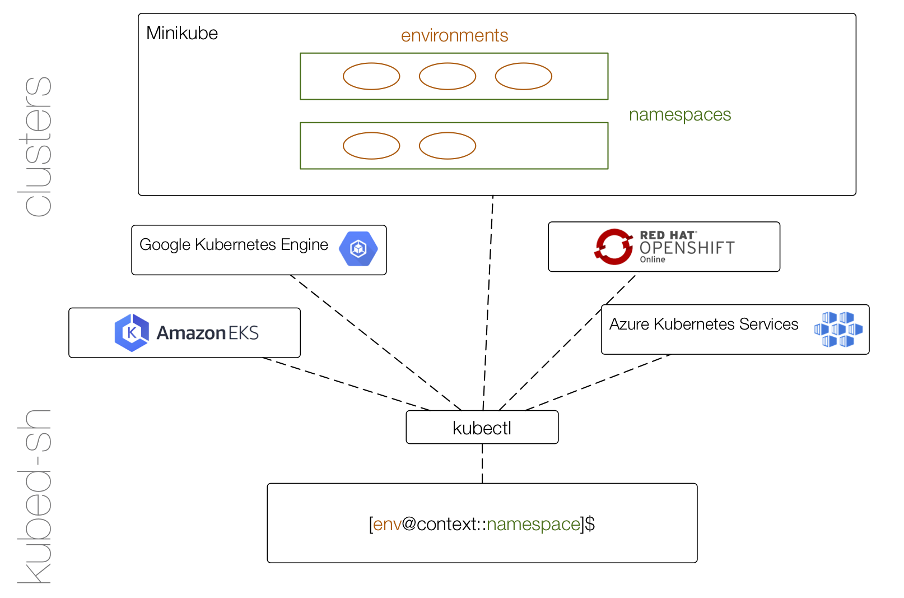

# Design

The system architecture looks as follows:

## Concepts

In this document we're using terms as follows:

- **Cluster**: a collection of Kubernetes control plane (master) and node (worker) [components](https://kubernetes.io/docs/concepts/overview/components/); can be local (Minikube for example) or remote (e.g., OpenShift Online).
- **Context**: when working with [multiple clusters](https://kubernetes.io/docs/tasks/access-application-cluster/configure-access-multiple-clusters/) this helps to pinpoint where exactly operations happen; technically a tuple `<name,cluster,authinfo,namespace>` that defines the execution target.
- **Environment**: a `kubed-sh` concept describing the current set of resources you're operating on; is part of a context. Note that environment is an extension of the (*nix local shell) concept of an environment into a set of clusters, located in exactly one Kubernetes namespace. For example, an environment has a list of environment variables and can be used for fine-grained execution control (scripting, project isolation).

## Components

- `kubed-sh` depends on `kubectl` for all cluster operations, that is, all remote operations in the cluster essentially cause shelling out to `kubectl`.
- We're using the REPL package [chzyer/readline](https://github.com/chzyer/readline) for shell interaction, incl. autocomplete, search and standard operations such as `CTRL+L` for clearing the screen.
- If a launch command via a binary or a script with an interpreted environment (initially: support for Node.js, Python, and Ruby) ends with an `&`, this causes the creation of a deployment and a service (name equals the name of the binary or script); this is good for any long-running app, effectively executing in the background.
- If the launch command doesn't end in an `&` then a pod is created; this is good for one-shot batch or interactive apps.
- It supports environment variables to define and overwrite behavior such as the images used, exposed service port, runtime features like hot-reload, etc.
