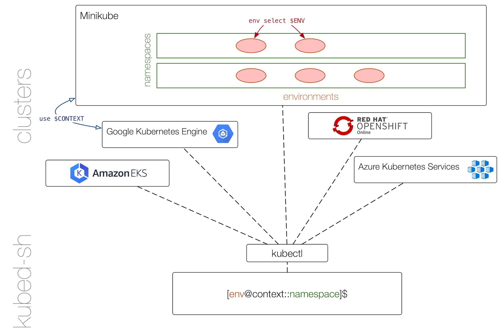

In the following we discuss the UX concepts of `kubed-sh` and review its architecture.


## UX concepts

In `kubed-sh` we're using terms as follows:

- **Cluster**: a collection of Kubernetes control plane (master) and node (worker) [components](https://kubernetes.io/docs/concepts/overview/components/); can be local (`kind` for example) or remote such as an EKS cluster.
- **Context**: when working with [multiple clusters](https://kubernetes.io/docs/tasks/access-application-cluster/configure-access-multiple-clusters/) the context helps to pinpoint where exactly operations happen. Technically, a context defines the execution target and is a tuple in the form of: `<name,cluster,authinfo,namespace>` 
- **Environment**: a `kubed-sh`-specific concept describing the current set of resources you're operating on; it is part of a context. Note that environment is an extension of the (*nix local shell) concept of an environment into a set of clusters, located in exactly one Kubernetes namespace. For example, an environment has a list of environment variables and can be used for fine-grained execution control (scripting, project isolation).

### Environments

In `kubed-sh` you can always tell the execution target by looking at the prompt. The general format of the prompt is as follows:

```
[environment@context::namespace]
```

For example:

```
[example.com@kind::demo]
```

Above means you're currently in the `example.com` environment, using the `minikube` context with the `default` namespace.

Here are the rules:

- If no environment is explicitly created, the global environment is used. The prompt then changes to `[context::namespace]`. This is the default at startup.
- The context can be changed by issuing the built-in `use` command.
- The environment can be changed by issuing the built in `env` command.
- If the environment name (`$ENV`) is a FQDN and you launch a long-running (background) process called `theapp` then the resulting underlying service will be exposed to the outside world at `$ENV/theapp`.

### Launching programs

`kubed-sh` follows two simple rules that mimic the behaviour you're used to from a local shell:

1. If a launch command via a binary or a script with an interpreted environment (initially: support for Node.js, Python, and Ruby) ends with an `&`, this causes the creation of a deployment and a service (name equals the name of the binary or script); this is good for any long-running app, effectively executing in the background.
1. If the launch command doesn't end in an `&` then a pod is created; this is good for one-shot batch or interactive apps.

 Further, `kubed-sh` supports environment variables to define and overwrite behavior such as the images used, exposed service port, runtime features like hot-reload, etc.


## Architecture

The system architecture of `kubed-sh` looks as follows:



In a nutshell, `kubed-sh` uses `kubectl` to launch and control binaries and scripts for you. It is multi-cluster and context aware and supports some local commands (such as `cd`, `ls`, `cat`) as well as a number of cluster commands, for example `ps`, `kill` or `curl`.


First and foremost `kubed-sh` depends on `kubectl` for all cluster operations. That is, all remote operations in the cluster essentially cause shelling out to `kubectl`. You can see what `kubectl` commands `kubed-sh` executes when you execute the `debug` built-in command.

To provide the shell interaction we're using the REPL package [chzyer/readline](https://github.com/chzyer/readline), offering autocomplete, search (`CTRL+R`) and other standard operations such as `CTRL+L` for clearing the screen.

`kubed-sh` is stateless, meaning that any kind of state—such as environment membership, phases or app components—is entirely stored in Kubernetes, using labels and annotations.
