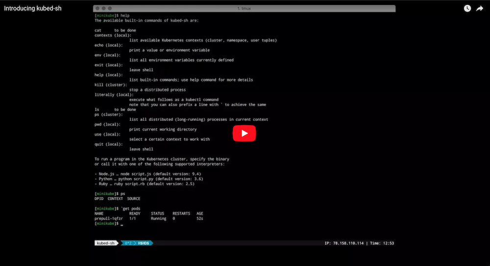
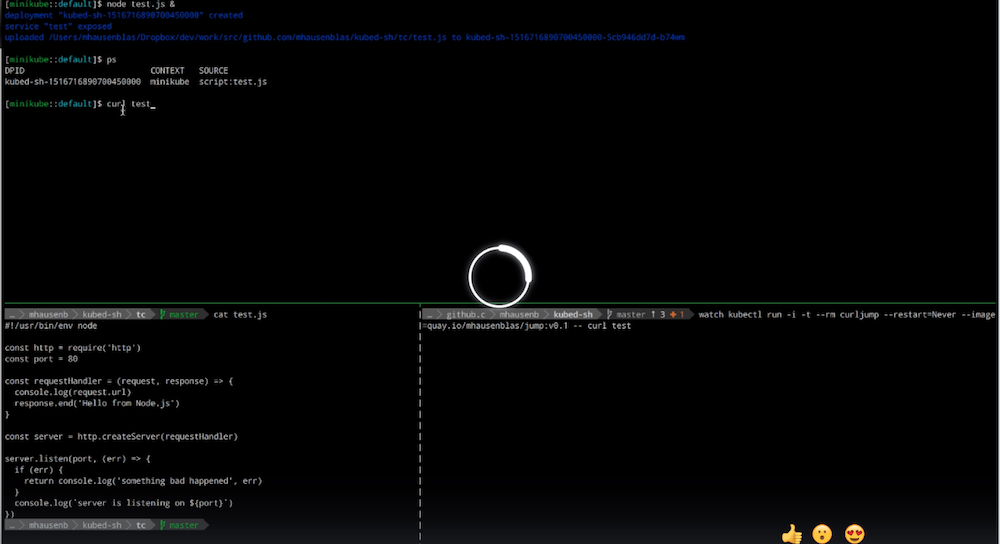

[](https://github.com/mhausenblas/kubed-sh/releases/)
[](https://github.com/mhausenblas/kubed-sh/issues)
[](https://goreportcard.com/report/github.com/mhausenblas/kubed-sh)

Welcome to `kubed-sh`, the Kubernetes distributed shell for the casual cluster user. 
In a nutshell, `kubed-sh` lets you execute a program in a Kubernetes cluster 
without having to create a container image or learn new concepts. 
For example, let's say you have a Node.js script called [test.js](https://raw.githubusercontent.com/mhausenblas/kubed-sh/master/tc/node/test.js) 
and you want to launch it as a containerized app in your Kubernetes cluster, 
here's what you'd need to do in `kubed-sh`:

```
[kind::default]$ node test.js &
[kind::default]$ ps
DPID                          SOURCE      URL
kubed-sh-1517679562543558000  test.js     test
```

Does this look familiar to what you do in your 'local' shell? That's the point of `kubed-sh` :)

| [](https://www.youtube.com/watch?v=gqi1-XLiq-o) | [](https://www.useloom.com/share/441a97fd48ae46da8d786194f93968f6) |
|:--------------------------------:|:------------------------------------------:|
| *Introducing kubed-sh (5 min)*   | *kubed-sh hot-reload feature demo (3 min)* |

In addition to launching (Linux ELF) binaries directly, the following interpreted environments are currently supported:

- When you enter `node script.js`, a Node.js (default version: 12) environment is provided and `script.js` is executed.
- When you enter `python script.py`, a Python (default version: 3.6) environment is provided and the `script.py` is executed.
- When you enter `ruby script.rb`, a Ruby (default version: 2.5) environment is provided and the `script.rb` is executed.

Note that `kubed-sh` is a proper shell environment. This means you can expect
features such as auto-complete of built-in commands, 
history operations (`CTRL+R`), or clearing the screen (`CTRL+L`) to work as per usual.